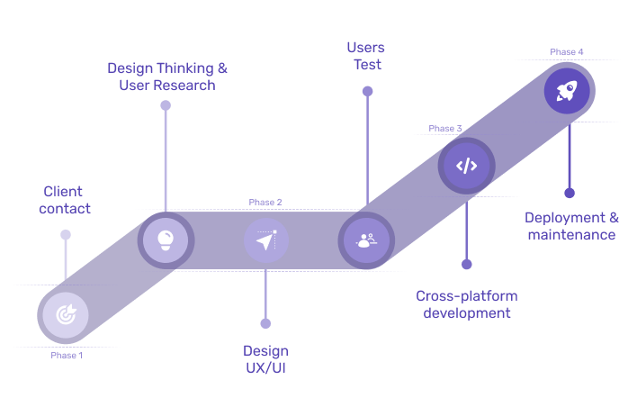

El ciclo de vida de un proyecto está conformado por 4 fases o procesos, estos procesos parten desde el contacto del cliente hasta la fase de despliegue o mantenimiento.

||
|:--:|
|*Proceso de ciclo de vida*|

En la imagen previa podemos observar 4 fases:
1. **Comercial**: Se realiza el primer contacto con el cliente, la recolección de recursos, requerimientos y demás, con el fin de generar una documentación inicial del proyecto. Por otro lado, también se tiene el primer contacto del cliente con quienes van a dirigir, diseñar y desarrollar su proyecto.
2. **Diseño**: Se aplica investigación de usuario, y mercado para iniciar el proyecto con el enfoque correcto. En base a requerimientos o necesidades se procede a diseñar y evaluar con usuarios el prototipado de media y alta fidelidad, con la finalidad de determinar la usabilidad.
3. **Desarrollo**: Bajo un diseño de interfaces realizado por el equipo de Paulonia o de parte del cliente, el equipo de desarrolladores procede a maquetar y conectar funcionalidades Backend. Por otro lado, opcionalmente se puede hacer un análisis ASM (App Store Management).
4. **Despliegue**: En esta fase el proyecto estará disponible en las tiendas o entregado de forma directa al cliente en formato APK.
5. **Mantenimiento**: Adicionalmente Paulonia puede cubrir una eventual fase de mantenimiento solicitada por el cliente, en el que se pretenden atender errores y nuevas funcionalidades.
