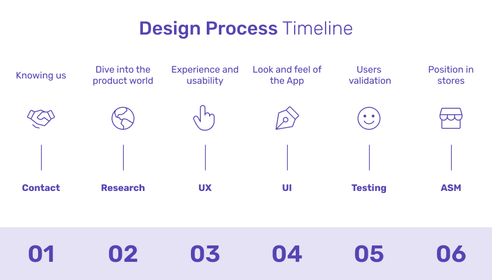

En proceso de diseño se rige a 6 etapas las 5 primeras son obligatorias y la última opcional según el proyecto.

||
|:--:|
|*Cronología del proceso de diseño*|

En la imagen previa podemos observar 6 etapas:

1. **Primer contacto**: Dentro del proceso de diseño el primer contacto hace referencia a la primera reunión donde se presentan a los involucrados tanto del lado de Paulonia como del cliente, y se pactan metodologías, responsabilidades, fechas y entregables.
2. **Research**: Etapa donde el equipo de Paulonia toma conocimiento de todo lo relacionado al producto desde las necesidades, limitaciones y competencia. Todo esto será aplicado en las etapas posteriores.
3. **UX**: Aquí podemos visualizar una primera versión del producto y el flujo de usuario final.
4. **UI**: Etapa donde el producto debe verse tal cual como llegará a los usuarios (versión final).
5. **Testing**: Primer acercamiento del producto con los usuarios finales, clave para detectar puntos de dolor y corregirlos.
6. **App Store Management**: De requerirlo el cliente, adicionalmente se procede hacer una investigación para posicionarse estratégicamente en tiendas.
